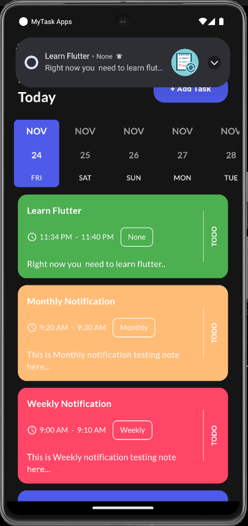

<<<<<<< HEAD
# Torbaaz Task Reminder App

A powerful and intuitive task reminder app built with Flutter, designed to help you manage your tasks efficiently and effectively.

## Key Features

- **Add, Edit, and Delete Tasks:** Easily manage your tasks.
- **Overall Progress Bar:** Visualize your overall task completion percentage.
- **Urgent Tasks Highlighted:** Quickly identify tasks that need immediate attention.
- **View Tasks by Date:** Organize and view tasks based on specific dates.
- **Task Progress Bar:** Track the completion percentage of individual tasks.
- **Great User Interface:** Clean, intuitive, and user-friendly design.
- **Subtasks:** Add subtasks within each major task.
- **Share Tasks:** Share task details externally or copy to clipboard.
- **Notification Control:** Enable or disable task reminders.
- **Mark Tasks as Complete:** Easily mark tasks as completed.
- **Sort and Filter Tasks:** Sort tasks by date and filter by update time.
- **Export Tasks:** Export tasks as PDF, CSV, and Excel files.
- **Notifications & Reminders:** Stay updated with timely notifications.
- **Dark & Light Mode:** Switch between themes for better visibility.
- **Responsive Design:** Optimized for various screen sizes.

## Table of Contents

- [Key Features](#key-features)
- [Screenshots](#screenshots)
- [Built With](#built-with)
- [Getting Started](#getting-started)
- [Contributing](#contributing)
- [Connect with Me](#connect-with-me)
- [Author](#author)

## Screenshots





## Built With

- [Flutter](https://flutter.dev/)
- [GetX](https://pub.dev/packages/get)
- [Get Storage](https://pub.dev/packages/get_storage)
- [Date Picker Timeline](https://pub.dev/packages/date_picker_timeline)
- [Flutter Local Notifications](https://pub.dev/packages/flutter_local_notifications)
- [Google Fonts](https://pub.dev/packages/google_fonts)
- [Percent Indicator](https://pub.dev/packages/percent_indicator)

## Getting Started

### Basic Flutter Guide

- [Flutter Documentation](https://flutter.dev/docs)
- [Flutter Installation](https://flutter.dev/docs/get-started/install)

### Installation

Clone the repository:

```bash
git clone https://github.com/AnsAsghar/Torbaaz_Task_reminder_app.git
cd Torbaaz_Task_reminder_app
flutter pub get
flutter run
```

## Contributing

Contributions are welcome! Please follow these steps:

1. Fork the repository.
2. Create a new feature branch.
3. Commit your changes with clear messages.
4. Open a pull request for review.

## Connect with Me

- [LinkedIn](https://www.linkedin.com/in/anas-asghar-aa7575202/)
- [YouTube](https://www.youtube.com/channel/UCejaga6msq18if3kap8m_ew)
- [Instagram](https://www.instagram.com/ansasghar/#)

## Author

- [Anas Asghar](https://github.com/AnsAsghar)

Happy coding! 😊
=======
# Torbaaz Task Reminder app
>>>>>>> 7dd222f28c37ffdbfb48ce6a33c1be3a8355858e
